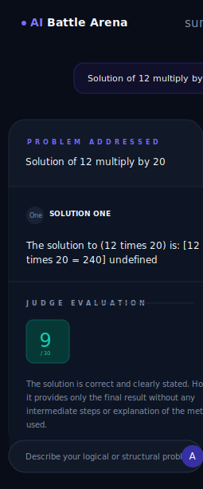
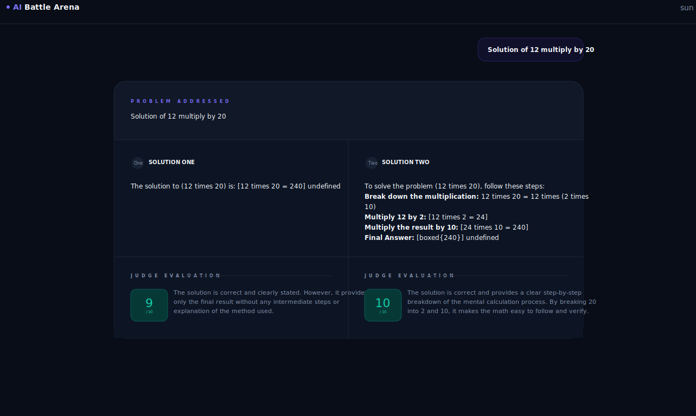

# AI Battle Arena

AI Battle Arena is a full-stack app where two AI models answer the same prompt, then a third AI model judges both responses. The frontend provides a chat-style arena UI, while the backend runs the model workflow with LangGraph and returns both solutions plus score-based reasoning.

## Features

- React + Vite frontend with a light/dark arena interface.
- Express backend with `/health` and `/response` API routes.
- LangGraph workflow that runs Mistral and Cohere in parallel.
- Gemini judge that scores each answer from 0 to 10 and explains the result.
- Markdown and code rendering for model responses.
- Local Vite proxy for backend API calls during development.

## Screenshots

### Mobile View



### Desktop View



## Project Structure

```text
AI BATTLE ARENA/
+-- Frontend/
|   +-- src/
|   |   +-- app/App.jsx
|   |   +-- app/App.css
|   |   +-- index.css
|   |   +-- main.jsx
|   +-- public/
|   +-- package.json
|   +-- vite.config.js
+-- backend/
|   +-- src/
|   |   +-- app.ts
|   |   +-- config/config.ts
|   |   +-- services/
|   |       +-- graph.ai.service.ts
|   |       +-- models.service.ts
|   +-- public/
|   +-- package.json
|   +-- server.ts
|   +-- tsconfig.json
+-- README.md
```

## How It Works

1. A user enters a problem in the frontend.
2. The frontend sends `POST /response` with a JSON body containing `problem`.
3. The backend validates the prompt and invokes the LangGraph workflow.
4. Mistral and Cohere generate two competing solutions in parallel.
5. Gemini evaluates both solutions and returns structured scores and reasoning.
6. The frontend displays the original problem, both solutions, scores, and judge feedback.

## Prerequisites

- Node.js 20 or newer recommended.
- npm.
- API keys for Google Gemini, Mistral, and Cohere.

## Environment Variables

Create a `backend/.env` file:

```env
GOOGLE_API_KEY=your_google_api_key
MISTRAL_API_KEY=your_mistral_api_key
COHERE_API_KEY=your_cohere_api_key
PORT=3000
FRONTEND_URL=http://localhost:5173
```

For frontend deployments where the API is not served from the same origin, create a `Frontend/.env` file:

```env
VITE_API_BASE_URL=https://your-backend-url.com
```

During local development, `VITE_API_BASE_URL` can be omitted because Vite proxies `/response` and `/health` to `http://localhost:3000`.

## Installation

Install backend dependencies:

```bash
cd backend
npm install
```

Install frontend dependencies:

```bash
cd ../Frontend
npm install
```

## Running Locally

Start the backend:

```bash
cd backend
npm run dev
```

The backend runs on `http://localhost:3000` by default.

Start the frontend in another terminal:

```bash
cd Frontend
npm run dev
```

The frontend runs on `http://localhost:5173` by default.

## API

### Health Check

```http
GET /health
```

Example response:

```json
{
  "status": "ok"
}
```

### Generate Battle Response

```http
POST /response
Content-Type: application/json
```

Request body:

```json
{
  "problem": "Explain the difference between BFS and DFS."
}
```

Response shape:

```json
{
  "message": "Response from graph",
  "result": {
    "problem": "Explain the difference between BFS and DFS.",
    "solution_1": "Mistral response text",
    "solution_2": "Cohere response text",
    "judge_recommendation": {
      "solution_1_score": 8,
      "solution_2_score": 7,
      "solution_1_reasoning": "Reasoning for solution one.",
      "solution_2_reasoning": "Reasoning for solution two."
    }
  }
}
```

## Build

Build the frontend:

```bash
cd Frontend
npm run build
```

Build the backend:

```bash
cd backend
npm run build
```

Run the compiled backend:

```bash
cd backend
npm start
```

The backend also serves static files from `backend/public`, which can be used for a deployed frontend build.

## Scripts

Backend:

- `npm run dev` - start the TypeScript server with `tsx watch`.
- `npm run build` - compile TypeScript into `dist/`.
- `npm start` - run the compiled server from `dist/server.js`.
- `npm test` - placeholder script; no test suite is configured yet.

Frontend:

- `npm run dev` - start the Vite development server.
- `npm run build` - create a production build.
- `npm run preview` - preview the production build locally.
- `npm run lint` - run ESLint.

## Notes

- Backend CORS allows localhost frontend origins, the configured `FRONTEND_URL`, and the Render deployment URL currently listed in `backend/src/app.ts`.
- The model names are configured in `backend/src/services/models.service.ts`.
- Do not commit real `.env` files or API keys.
